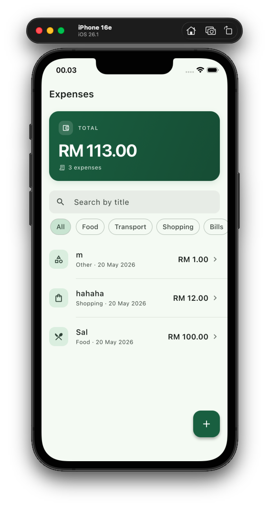
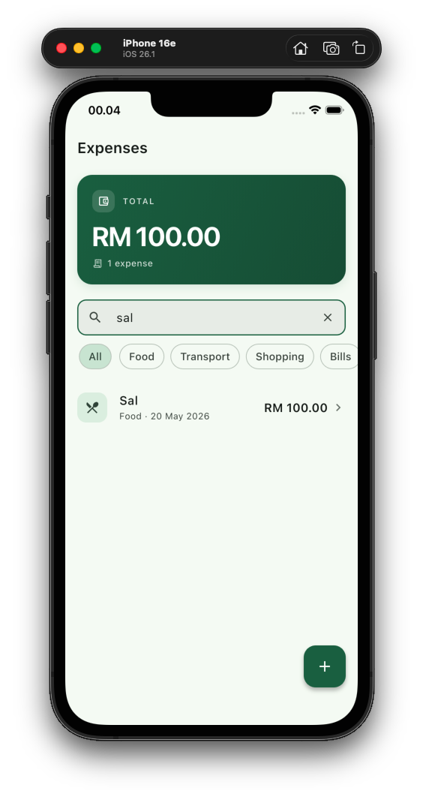

# Personal Expense Tracker

A small Flutter app to track personal spending. You log an expense with title, amount, date, and category. Then you see the list, edit it, or delete it. Everything stays on the device.

## Screenshots







## Features

- Add a new expense (title, amount, date, category)
- View the list with a total summary on top
- Edit an existing expense
- Delete with undo
- Search by title and filter by category
- Pull to refresh
- Empty, loading, and error states
- Data persists across restart

## Running it

```bash
flutter pub get
dart run build_runner build
flutter run
```

If iOS pods feel stale, run `cd ios && pod install` first. After changes to pubspec, do a full stop and start (not hot restart), otherwise the native plugin channels can get out of sync.

## Tech stack

- Flutter 3 (Dart sdk `^3.11.0`)
- `flutter_riverpod` and `riverpod_annotation` 3.0 for state
- `drift` 2.28 with `drift_flutter` and `sqlite3_flutter_libs` for the local database
- `freezed` 3 for immutable models
- `fpdart` 1.2 for typed error handling in the repository
- `go_router` 16 for navigation
- `intl` for money and date formatting
- `path_provider` (pinned to 2.5.1 because newer versions fail to load on this Flutter version)

## Folder structure

```
lib/
  main.dart
  app.dart
  common/        cross-feature UI and theme
  db/            Drift database and tables
  routing/       go_router config
  utils/         AppFailure and formatters
  features/
    expense/
      shared/    things shared between add, edit, list
        model/, repository/, widgets/
      add/       add screen and vm
      edit/      edit screen and vm
      list/      list screen, vm, and widgets
```

Each screen folder follows the same shape: `screen/`, `vm/`, and optionally `widgets/`.

## Why these choices

MVVM with a repository because it is simple and easy to read. The ViewModel is a Riverpod Notifier that holds an AsyncValue, and the repository wraps Drift queries. No Clean Architecture layers because for two screens that would be over-engineering.

Drift because it is typed, has reactive streams, and is lightweight. Other options like Isar and ObjectBox felt less safe to bet on in 2026.

Freezed for the models so I get copyWith, equality, and toString for free.

fpdart so the repository can return `TaskEither<AppFailure, T>` instead of throwing. The VM pattern-matches the result into AsyncValue, so the error path is part of the signature.

Riverpod with code generation removes most of the provider boilerplate. The filtered list is a derived provider that watches the raw list and the filter state. Search and chips never touch the database, they just trigger a re-derivation in memory.

## Limitations

Things I would do next if I had more time:

- Currency is hardcoded to RM. It should follow locale or be a user setting.
- Categories are a fixed enum. You can't add custom ones. Would need a separate table for that.
- Search is title only and category is single-select. A date range and multi-select category would scale better.
- No charts. A simple by-category pie or a monthly trend would make the summary more useful.
- Tests cover the repository, the add VM, and the list widget. A VM test for the list filter is missing.
- No backup or export. If the device is gone, the data is gone.

## A note on AI

I used AI for boilerplate (the codegen flow), for checking Riverpod 3 changes, and for thinking through trade-offs between local DB options. The architecture and the library choices are mine.
